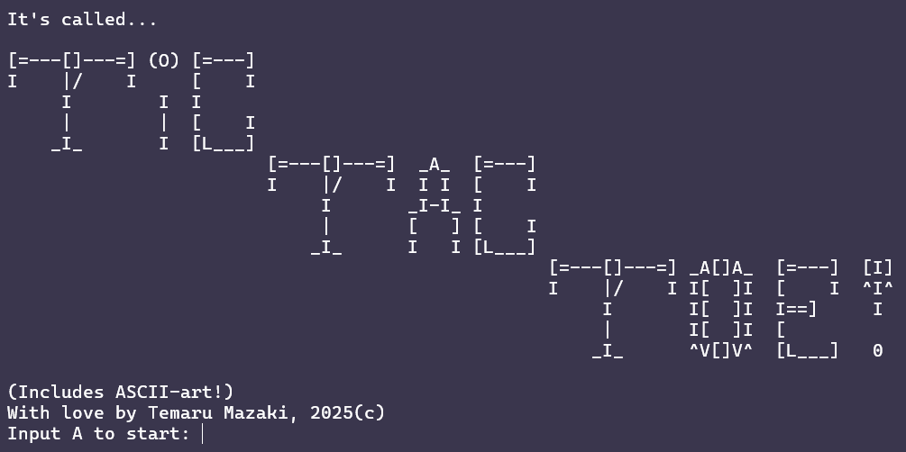
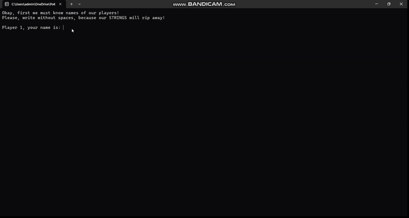
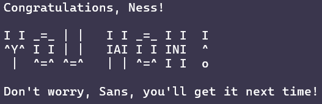

Hi, this is one of my first projects on C++.
I've started learning C++ nearly 3 months ago, so my level of knowledge is kinda of beginner.

This project may not be perfect, it may not be optimised, but for my level of knowing C++, it's really great, imo.

# What is Tic Tac Toe?
It's a pretty famous simple turn-based game. You play either as **Xs** or **Os** on 3x3 board and must make a row of three characters to win.
This game is for 2 players, so your rival has the same goal as yours, but uses different character.
For example, if you use **Xs**, your rival will use **Os** and vice versa.

If all board is filled with characters and there's no winning combinations, there will be **draw**.

# About my project

My project is multiplayer version of this game, because I'm too low to make "Vs. CPU" mode.
But still, I like my creation a lot.
Project features a little intro I made, after which we see big ASCII-art-styled logo of the game:

Here you must type capital or small letter `A` to start the game.
Then, you(and your friend, if you have one) have to type names of players(without spaces, as you can see) and *how many rounds you wanna play*.
And then the fun begins!
Xs and Os also ASCII-art-styled, by the way, but their designs are kinda simple, ngl.

To place your character in the board, you must type both row and column you want it to be in - it's because the board is 3x3 matrix.
Wanna place your X at the center? Type 2, the 2 again.
Wanna place your O at the upper right corner? Type 1, then 3.
First number is a row, second one - is a column. Yup, it's pretty simple.

If you make a winning combination, you gain a +1 point to your **score**(you can see it in the upper part of console).
If your **score** equals to *number of rounds*, you win:

# Known flaws

- Because of the intro, the game starts kinda slow;
- Names of players can't have spaces, because of them being `string` data type;
- The game has no code that responds in case if there's a draw.

That's all! Hope you like it!
- Maru.
